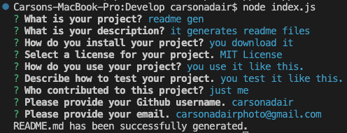

# 09 Node.js Challenge: Professional README Generator

In this project I created a README.md generator using node.js and inquirer. 
This app is run by using the command ```node index.js```.

When you run this app, you are prompted with a series of questions in the command line that you can type answers to in the input. 
When the license question is prompted, you are provided with a list of items you can choose from with your arrow keys.

When the questions are all completed, the app will say you have successfully created your README.md file. 
The file will appear in your folder with all your inputed answers. 

Here is the link to the Github Repo https://github.com/carsonadair/readme-generator



